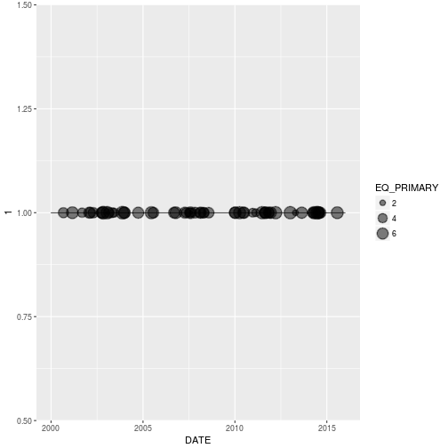
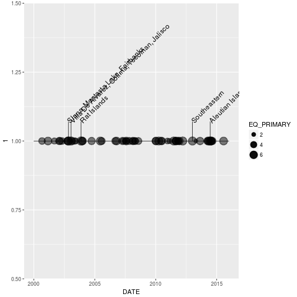
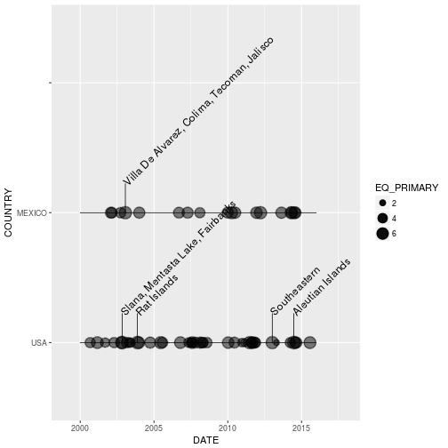

## Earthquake Tools Package - eqtools 

The eqtools package makes it easy for  users to explore the  U.S. National Oceanographic and Atmospheric Administration (NOAA) dataset on significant earthquakes around the world. This dataset contains information about 5,933 earthquakes over an approximately 4,000 year time span.

### Downloading dataset

The datset is available from the [NOAA Website](https://www.ngdc.noaa.gov/nndc/struts/form?t=101650&s=1&d=1)
The entire dataset can be download by clicking on the link: "Download entire significant earthquake data file in tab-delimited format."

### What Eqtools includes

- Functions to clean the data to prepare for 
- Geoms to create timeline plots
- Functions to create interactive html maps 

### Data: NOAA significant earthquake data 


```r
     library(readr)
     eqdata <- read_delim(  system.file("extdata",
                          "signif-july-2017.txt.gz",
			   package = "eqtools"),delim = "\t")
```

```
## Parsed with column specification:
## cols(
##   .default = col_integer(),
##   FLAG_TSUNAMI = col_character(),
##   SECOND = col_character(),
##   EQ_PRIMARY = col_character(),
##   EQ_MAG_MW = col_character(),
##   EQ_MAG_MS = col_character(),
##   EQ_MAG_MB = col_character(),
##   EQ_MAG_ML = col_double(),
##   EQ_MAG_MFA = col_character(),
##   EQ_MAG_UNK = col_character(),
##   COUNTRY = col_character(),
##   STATE = col_character(),
##   LOCATION_NAME = col_character(),
##   LATITUDE = col_character(),
##   LONGITUDE = col_character(),
##   DEATHS = col_character(),
##   MISSING = col_character(),
##   INJURIES = col_character(),
##   DAMAGE_MILLIONS_DOLLARS = col_character(),
##   TOTAL_DEATHS = col_character(),
##   TOTAL_MISSING = col_character()
##   # ... with 2 more columns
## )
```

```
## See spec(...) for full column specifications.
```

```r
    dim(eqdata)
```

```
## [1] 5952   47
```

### Cleaning tools

eq_clean_data convert LATITUDE and LONGITUDE to numeric


```r
    library(eqtools)
    str(eqdata$LATITUDE)
```

```
##  chr [1:5952] "  31.100" "  38.000" "  35.683" "  36.400" "  31.500" ...
```

```r
    eq_data_clean <- eq_clean_data(eqdata)
    str(eq_data_clean$LATITUDE)
```

```
##  num [1:5952] 31.1 38 35.7 36.4 31.5 ...
```

eq_clean_location removes country from LOCATION_NAME and converts it to title case


```r
    eqdata$LOCATION_NAME[1]
```

```
## [1] "JORDAN:  BAB-A-DARAA,AL-KARAK"
```

```r
    eq_data_ready <- eq_clean_location(eq_data_clean)
    eq_data_ready$LOCATION_NAME[1]
```

```
## [1] "Bab-a-Daraa,al-Karak"
```

### Plotting Tools

geom_timeline() creates a timeline plot of eathquakes by year


```r
    library(dplyr)
    library(ggplot2)
    library(grid)
    minDate <- as.Date("2000-1-1","%Y-%m-%d")	  
    maxDate <- as.Date("2015-12-31","%Y-%m-%d")	  
    eq_us_mex_data <- mutate(eq_data_ready) %>%
          filter( DATE >= minDate,DATE <= maxDate, COUNTRY %in% c("USA","MEXICO")) %>%
	  mutate(EQ_PRIMARY = as.numeric(EQ_PRIMARY))
     ggplot(eq_us_mex_data,aes(x = DATE, y = 1,
         xmin = minDate,xmax = maxDate,
         )) +
  geom_timeline(aes(size = EQ_PRIMARY))
```



geom_timeline_label() adds labels to the geom_timeline plot


```r
    #library(ggplot2)
     ggplot(eq_us_mex_data,aes(x = DATE, y = 1,
         xmin = minDate,xmax = maxDate,
         )) +
  geom_timeline(aes(size = EQ_PRIMARY)) +
  geom_timeline_label(aes(label = LOCATION_NAME,size = EQ_PRIMARY,n_max = 5))
```



If `y` is set to a data column the timelines are split up.
xlim and ylim can be added to adjust for labels.


```r
    #library(ggplot2)
     ggplot(eq_us_mex_data,aes(x = DATE, y = COUNTRY,
         xmin = minDate,xmax = maxDate,
         )) +
  geom_timeline(aes(size = EQ_PRIMARY)) +
  geom_timeline_label(aes(label = LOCATION_NAME,size = EQ_PRIMARY,n_max = 5)) + 
  xlim(as.Date("1999-1-1","%Y-%m-%d"),as.Date("2017-12-31","%Y-%m-%d")	) + 
  ylim(c(as.character(unique(eq_us_mex_data$COUNTRY)),""))
```


### Mapping Tools

eq_map creates a leaflet map

```r
      library(leaflet)
      
      #eq_map(eq_us_mex_data,annot_col = eq_us_mex_data$DATE)
```

eq_create_label() formats information to be used in a web popup


```r
  popup_labels <- eq_create_label(eq_us_mex_data) 
  paste(popup_labels[1],"\n")
#> [1] "<b>Location</b> Napa <br /> <b>Magnitude:</b> 5 <br /> <b>Total deaths:</b> NA <br /> \n"
```

Add the labels to the map

```r
  #eq_data_pop <- mutate_(eq_us_mex_data,pop = ~ popup_labels)
  #eq_map(eq_us_mex_data,annot_col = eq_us_mex_data$pop)
```


> "He who gives up [code] safety for [code] speed deserves neither."
([via](https://twitter.com/hadleywickham/status/504368538874703872))
